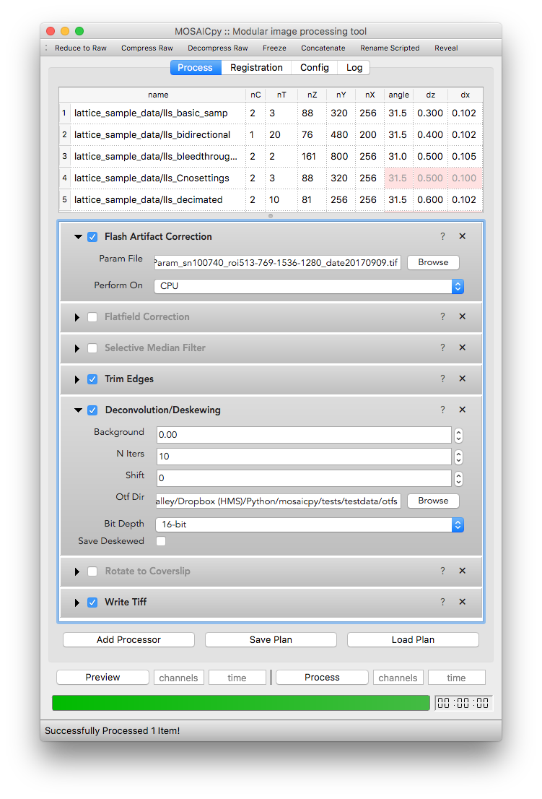

########
MOSAICpy
########

.. image:: https://raw.githubusercontent.com/tlambert03/LLSpy/develop/img/cbmflogo.png
    :target: https://cbmf.hms.harvard.edu/lattice-light-sheet/

.. |copy|   unicode:: U+000A9

Copyright |copy| 2019 Talley Lambert, Harvard Medical School.

|

*NOTE: this is very much a work in progress and is not ready
for routine use. There are many broken imports, and residual llspy
references still.*

Basic Idea
==========

MOSAICpy (i.e. "LLSpy2") is a modular image processing app written in Python.
The basic idea is to string together a series of processing
steps ("Image Processors"), each of which accept a multi-dimensional
image and metadata as input, perform some actions on or with the
image, and pass it (or a modified version of it) down the chain
for further processing.  The actions may be standard image processing,
like a flatfield correction, cropping, or deconvolution, etc..., but
they can be anything you can code in python, such reading/writing to
disk/network, or connecting to a server.

Image Processors
----------------

All image processors must be subclassed from :code:`llspy.ImgProcessor`.
All subclasses of ImgProcessor must override the :code:`process(data, meta)`
method, which should accept a numpy array and return a two-tuple containing
the processed array and the metadata object (which may be modified).
Any files placed into the plugin directory will be parsed for classes
that implement a :code:`process` method and added to the list of available
processors.  The signature of the :code:`__init__` method of the
:code:`ImgProcessor` will be introspected and text fields,
dropdown-menus, or checkboxes will appear in the graphical user interface
reflecting the parameters accepted by that particular :code:`ImgProcessor`.
(see image above as an example).  A very simple image processor might look
like this:

.. code:: python

    from llspy import ImgProcessor

    class Plugin(ImgProcessor):
        """ This Processor simply prints the shape of the
        data to the console."""

        def process(data, meta):
            print(f"The shape of this data is {data.shape}")
            return data, meta

Process Plans
-------------

Processors can then be reordered in the the main
window by dragging and dropping, enabled, disabled, added, and removed.
A set and order of ImgProcessors, along with a target data directory, is
referred to as a "plan" and controlled by the
:code:`llspy.processplan.ProcessPlan` class (which can do some validity
checking and make assertions about the order of processors).  Plans can
be saved, recalled, and (hopefully) shared.

To Do:
------

* Figure out how to deal with "forks" in the processing path.  For instance,
  decon/deskew will have both deconvolved output and deskewed output.
  Possibly... turn that into a deskew step, then tiffwriter, then decon step.